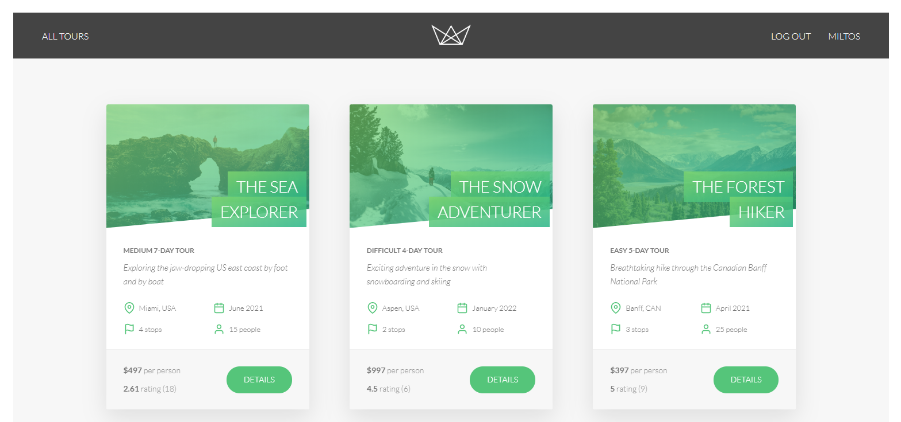
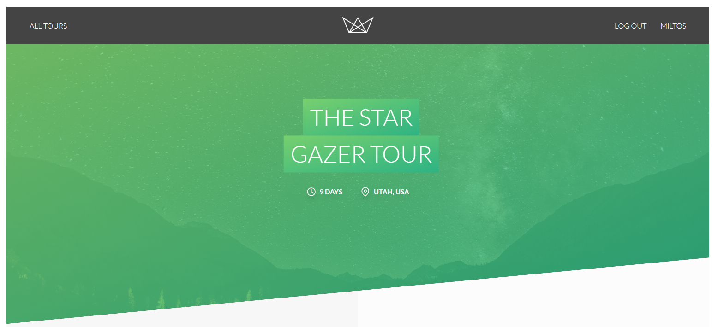

# NodeJS_WebApp
Full Back-End Server using NodeJS, JavaScript, CSS and HTML. Already Implemented Users, login system, API for collection of information

## What was developed in this project
This is a Full Web Application, you can:
1. Login, as a user
2. Buy Tours 
3. Make Reviews of this tours
4. Show multiple Tours and informatoin about them
5. Mongo Database was build
6. Also everything runs throw Micro Services with an API

